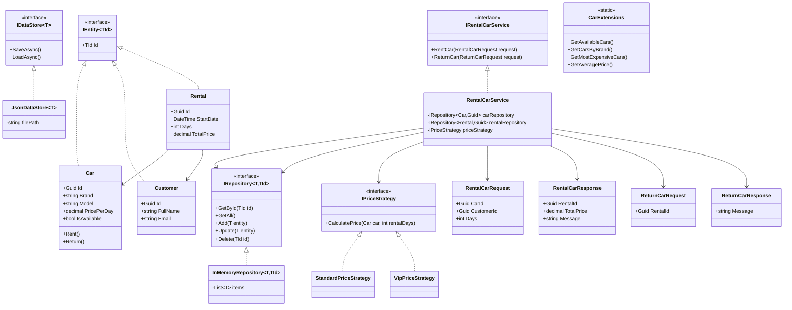

# Class Diagram

```mermaid
classDiagram

class IEntity~TId~ {
    <<interface>>
    +TId Id
}

class Car {
    +Guid Id
    +string Brand
    +string Model
    +decimal PricePerDay
    +bool IsAvailable
    +Rent()
    +Return()
}

class Customer {
    +Guid Id
    +string FullName
    +string Email
}

class Rental {
    +Guid Id
    +DateTime StartDate
    +int Days
    +decimal TotalPrice
}

class IRepository~T,TId~ {
    <<interface>>
    +GetById(TId id)
    +GetAll()
    +Add(T entity)
    +Update(T entity)
    +Delete(TId id)
}

class InMemoryRepository~T,TId~ {
    -List~T~ items
}

class IDataStore~T~ {
    <<interface>>
    +SaveAsync()
    +LoadAsync()
}

class JsonDataStore~T~ {
    -string filePath
}

class IRentalCarService {
    <<interface>>
    +RentCar(RentalCarRequest request)
    +ReturnCar(ReturnCarRequest request)
}

class RentalCarService {
    -IRepository~Car,Guid~ carRepository
    -IRepository~Rental,Guid~ rentalRepository
    -IPriceStrategy priceStrategy
}

class RentalCarRequest {
    +Guid CarId
    +Guid CustomerId
    +int Days
}

class RentalCarResponse {
    +Guid RentalId
    +decimal TotalPrice
    +string Message
}

class ReturnCarRequest {
    +Guid RentalId
}

class ReturnCarResponse {
    +string Message
}

class IPriceStrategy {
    <<interface>>
    +CalculatePrice(Car car, int rentalDays)
}

class StandardPriceStrategy {
}

class VipPriceStrategy {
}

class CarExtensions {
    <<static>>
    +GetAvailableCars()
    +GetCarsByBrand()
    +GetMostExpensiveCars()
    +GetAveragePrice()
}

IEntity~TId~ <|.. Car
IEntity~TId~ <|.. Customer
IEntity~TId~ <|.. Rental

IRepository~T,TId~ <|.. InMemoryRepository~T,TId~

IDataStore~T~ <|.. JsonDataStore~T~

IRentalCarService <|.. RentalCarService

IPriceStrategy <|.. StandardPriceStrategy
IPriceStrategy <|.. VipPriceStrategy

Rental --> Car
Rental --> Customer

RentalCarService --> IRepository~Car,Guid~
RentalCarService --> IRepository~Rental,Guid~
RentalCarService --> IPriceStrategy

RentalCarService --> RentalCarRequest
RentalCarService --> RentalCarResponse
RentalCarService --> ReturnCarRequest
RentalCarService --> ReturnCarResponse
```
