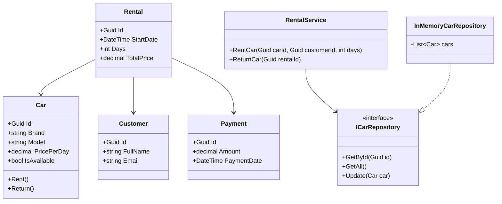

# Class Diagram

```mermaid
classDiagram

class Car {
    +Guid Id
    +string Brand
    +string Model
    +decimal PricePerDay
    +bool IsAvailable
    +Rent()
    +Return()
}

class Customer {
    +Guid Id
    +string FullName
    +string Email
}

class Rental {
    +Guid Id
    +DateTime StartDate
    +int Days
    +decimal TotalPrice
}

class Payment {
    +Guid Id
    +decimal Amount
    +DateTime PaymentDate
}

class ICarRepository {
    <<interface>>
    +GetById(Guid id)
    +GetAll()
    +Update(Car car)
}

class InMemoryCarRepository {
    -List~Car~ cars
}

class RentalService {
    +RentCar(Guid carId, Guid customerId, int days)
    +ReturnCar(Guid rentalId)
}

Rental --> Car
Rental --> Customer
Rental --> Payment

RentalService --> ICarRepository
InMemoryCarRepository ..|> ICarRepository
```
