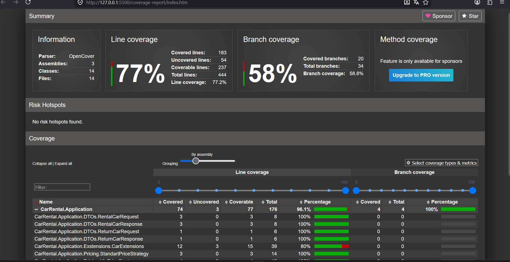

# Iteration 3

## Summary

Iteration 3 focused on quality assurance, automated testing, fault handling, and project stabilization.

## Implemented Improvements

### Unit Testing

Added extensive unit test coverage for:

- RentalCarService
- Car entity
- Pricing strategies
- Extension methods
- JSON persistence

### Integration Testing

Added integration tests for:

- Save and reload workflows
- Persistence verification
- Business workflow restoration

### Fault Handling

Verified handling of:

- Missing cars
- Missing rentals
- Invalid operations
- Missing files
- Corrupted data

### Code Quality

Improved testability by:

- Using repository abstractions
- Separating business logic from infrastructure
- Maintaining dependency inversion

## Metrics

### Unit Tests

More than 20 unit tests implemented.

### Integration Tests

At least 8 integration tests implemented.

### Coverage

Coverage collected using Coverlet.

### Remaining Risks

- Rental persistence is currently in-memory only.
- Console UI validation can be improved.
- Additional domain validation may be added in Lab 37.

## Planned Improvements for Lab 37

- Enhanced fault recovery
- Additional integration scenarios
- Improved reporting
- Final project hardening
