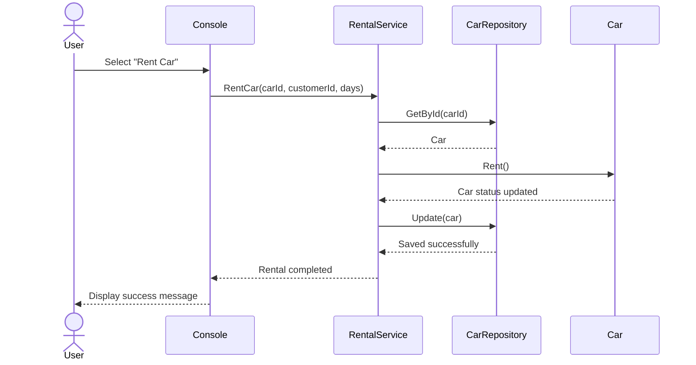

# Sequence Diagram

```mermaid
sequenceDiagram

actor User

participant Console
participant RentalService
participant CarRepository
participant Car

User ->> Console: Select "Rent Car"

Console ->> RentalService: RentCar(carId, customerId, days)

RentalService ->> CarRepository: GetById(carId)

CarRepository -->> RentalService: Car

RentalService ->> Car: Rent()

Car -->> RentalService: Car status updated

RentalService ->> CarRepository: Update(car)

CarRepository -->> RentalService: Saved successfully

RentalService -->> Console: Rental completed

Console -->> User: Display success message
```
